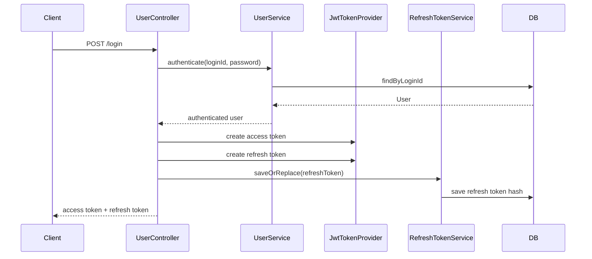
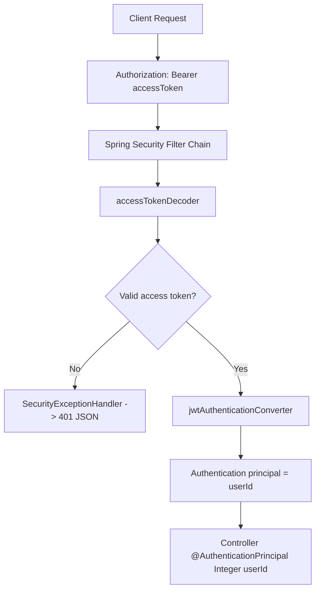
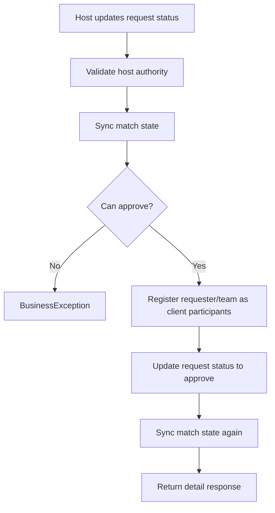

# GameMatch Backend

> 게임별 커뮤니티, 게임 프로필, 친선 경기 생성/신청/참여 기능을 제공하는 Spring Boot REST API 백엔드입니다.
>
> 엔티티별 패키지를 기준으로 Controller, Domain, DTO, Repository, Service를 분리하고, VO 기반 도메인 모델, JWT 인증, Refresh Token Rotation, 매칭 상태 정합성, Supabase PostgreSQL Seed 흐름을 함께 정리했습니다.

## Project Info

- 프로젝트 목적: 게임 커뮤니티와 친선 경기 매칭 도메인을 Spring Boot REST API로 구현
- 아키텍처 방향: Clean Architecture를 참고한 엔티티 중심 패키지 구조
- 인증 방식: Spring Security OAuth2 Resource Server 기반 JWT 인증
- 데이터베이스: Supabase PostgreSQL 운영 흐름과 local H2/MySQL 개발 흐름 지원
- 데이터 생성: Python Faker 기반 대량 seed 데이터 생성
- 문서화: API 흐름, 트러블슈팅, 단계별 구현 기록 관리

## Tech Stack

### Backend


### Database / Infra


### Tools


## Overview

GameMatch Backend는 사용자가 게임별 프로필을 만들고, 게임 그룹에 소속되며, 친선 경기를 생성하거나 신청할 수 있는 매칭 서비스 API입니다.

기존의 단순 CRUD 흐름에서 끝나지 않고, 다음 부분을 중점적으로 다뤘습니다.

- 사용자의 로그인 세션을 JWT access token과 refresh token으로 관리
- refresh token을 원문 그대로 저장하지 않고 해시로 저장
- VO를 엔티티 필드로 사용해 도메인 값 검증을 객체 내부로 이동
- Repository 인터페이스와 JPA 구현체를 분리해 서비스가 JPA 세부 구현에 직접 의존하지 않도록 정리
- 매칭 신청 승인, 취소, 거절, 자동 마감 과정에서 데이터 정합성을 유지
- LAZY 로딩과 EntityGraph를 함께 사용해 N+1 문제를 제어
- CommonResponse로 성공/실패 응답 형식을 통일

## Key Features

- 회원가입, 로그인, 로그아웃, access token 재발급
- refresh token rotation 및 서버 저장 토큰 무효화
- 게임 목록 조회, 게임별 그룹 조회 및 생성
- 사용자의 게임 프로필 생성, 수정, 닉네임 검색
- 친선 경기 생성, 검색, 호스트 경기 목록 조회
- 경기 참여자 등록 및 참여자 충돌 검사
- 친선 경기 신청, 신청 상세 조회, 승인, 거절, 취소
- 게시글, 댓글, 대댓글, 이미지, 추천 기능
- 친구 목록 조회
- 휴대폰 인증 코드 발송 및 검증
- 만료된 친선 경기 자동 마감
- Supabase PostgreSQL용 대량 seed 데이터 생성

## Core Implementation

### 1. Clean Architecture Inspired Package Structure

엔티티 단위로 패키지를 나누고, 각 패키지 안에서 역할을 다시 분리했습니다.

```text
controller  -> HTTP 요청/응답 담당
dto         -> Request, Response, Service DTO
domain      -> JPA Entity, 도메인 메서드
domain/vo   -> 값 검증과 표현을 담당하는 Value Object
repository  -> 도메인 관점의 Repository 인터페이스
repository/jpa -> Spring Data JPA 구현체와 Adapter
service     -> 유스케이스와 트랜잭션 처리
```

Controller는 HTTP DTO를 받고 Service DTO로 변환합니다.  
Service는 VO와 Entity를 만들어 Repository로 넘기고, 응답은 Response DTO로 변환합니다.

이 구조 덕분에 HTTP 요청 형식, 도메인 규칙, DB 접근 방식이 한 파일에 섞이지 않도록 정리했습니다.

### 2. VO Based Domain Model

문자열, 숫자 같은 원시 타입을 그대로 엔티티에 두지 않고, 의미 있는 값은 VO로 감쌌습니다.

예시는 다음과 같습니다.

- `EmailVo`
- `LoginIdVo`
- `LoginPasswordVo`
- `GameNameVo`
- `GameUserNicknameVo`
- `FriendlyMatchStateVo`
- `TokenHashVo`

JPA 저장을 위해 VO마다 Converter를 두고, 엔티티 필드에서는 `@Convert`를 사용합니다.

```java
@Column(name = "Nickname", nullable = false, length = 255)
@Convert(converter = GameUserNicknameVoConverter.class)
private GameUserNicknameVo nickname;
```

VO를 사용하면 값 검증이 Controller나 Service 곳곳에 흩어지지 않고, 도메인 값 객체 안으로 모입니다.

### 3. JWT Authentication

인증은 Spring Security OAuth2 Resource Server 기반으로 처리합니다.

직접 문자열을 파싱하는 방식이 아니라, Spring Security가 제공하는 `JwtEncoder`, `JwtDecoder`, `NimbusJwtEncoder`, `NimbusJwtDecoder`를 Bean으로 등록해서 사용합니다.

핵심 흐름은 다음과 같습니다.

- `JwtConfig`가 JWT 서명용 `SecretKey`를 생성
- `JwtEncoder`가 access token, refresh token 생성
- access token decoder와 refresh token decoder를 분리
- JWT `type` claim으로 access token과 refresh token 용도를 구분
- Security Filter Chain에서는 access token만 API 인증에 사용
- refresh token은 `/token/refresh`에서만 별도로 검증

JWT claim 구조는 사용자 ID를 `sub`에 담고, token 종류를 `type`에 담는 방식입니다.

```text
sub  -> userId
type -> access | refresh
```

### 4. Refresh Token Rotation

refresh token은 `User` 엔티티에 직접 두지 않고, 별도 `RefreshToken` 엔티티로 분리했습니다.

저장 방식도 원문 저장이 아니라 SHA-256 해시 저장입니다.

```text
로그인 성공
  -> access token 발급
  -> refresh token 발급
  -> refresh token hash 저장

토큰 재발급
  -> refresh token 검증
  -> DB에 저장된 hash와 비교
  -> 새 access token 발급
  -> 새 refresh token 발급
  -> DB hash 교체

로그아웃
  -> 클라이언트 토큰 삭제
  -> 서버 refresh token hash 삭제
```

이 구조는 탈취된 refresh token의 재사용 가능성을 줄이고, 서버에서 refresh token을 무효화할 수 있게 해줍니다.

### 5. CommonResponse

API 응답 형식은 `CommonResponse<T>`로 통일했습니다.

```json
{
  "success": true,
  "message": "Success",
  "data": {}
}
```

실패 응답도 같은 형식으로 내려갑니다.

```json
{
  "success": false,
  "message": "Unauthorized",
  "data": null
}
```

MVC 영역의 예외는 `GlobalExceptionHandler`에서 처리하고, Spring Security 필터 체인에서 발생하는 401/403은 `SecurityExceptionHandler`에서 같은 응답 형식으로 처리합니다.

### 6. Match Request State Management

친선 경기 신청은 단순히 status만 바꾸는 구조가 아니라, 상태 변경에 따라 관련 데이터도 함께 맞춰야 합니다.

예를 들어 신청이 승인되면 다음 일이 함께 일어납니다.

- 신청 상태를 `approve`로 변경
- 신청자와 팀원을 경기 참여자 목록에 client로 등록
- 이미 승인된 신청이 있으면 중복 승인 방지
- 모집 마감 시간이 지난 경기는 승인 불가
- 승인 취소 시 등록된 client 참여자를 제거
- 승인 때문에 닫힌 다른 신청은 필요한 경우 대기 상태로 복구

상태 변경 로직은 `MatchRequestStatusOperations`와 `MatchRequestStatusHandler` 계층으로 분리했습니다.

### 7. Data Consistency

데이터 정합성을 위해 DB 제약 조건과 서비스 검증을 함께 사용했습니다.

대표적인 정합성 규칙은 다음과 같습니다.

- 한 사용자는 같은 게임에 하나의 게임 프로필만 가질 수 있음
- 같은 게임 안에서 닉네임은 중복될 수 없음
- 경기의 게임과 호스트 게임 프로필의 게임이 일치해야 함
- 신청자와 팀원은 같은 시간대에 중복 신청할 수 없음
- 이미 참여 중인 경기에 다시 참여할 수 없음
- 경기 호스트만 신청 상태를 승인/거절할 수 있음
- 신청자 본인만 자신의 신청을 취소할 수 있음

`@Transactional` 안에서 영속 엔티티를 수정하고, JPA dirty checking을 활용해 변경 사항을 저장합니다.

### 8. JPA Loading Strategy

연관관계는 기본적으로 `FetchType.LAZY`를 사용했습니다.

불필요한 조인을 기본값으로 만들지 않고, 응답 DTO 변환에 필요한 API에서만 `@EntityGraph`를 사용해 필요한 연관 데이터를 한 번에 가져옵니다.

```java
@EntityGraph(attributePaths = {"user", "game", "group"})
Optional<GameUser> findById(Integer id);
```

이 방식은 순환 참조 위험을 줄이고, DTO 변환 시 발생할 수 있는 N+1 문제를 제어하기 위한 선택입니다.

### 9. Expired Match Scheduler

만료된 친선 경기는 Spring Scheduler로 자동 마감합니다.

현재 구조는 Spring Batch Job이 아니라, 다음 흐름입니다.

- `@EnableScheduling`으로 스케줄링 활성화
- `MatchScheduler`가 애플리케이션 시작 시 한 번 실행
- 이후 매시 정각마다 만료 경기 마감 실행
- Repository의 bulk update로 기간이 지난 경기 상태 변경

```text
Application Start
  -> MatchScheduler.init()
  -> updateExpiredMatches()

Every Hour
  -> @Scheduled(cron = "0 0 * * * *")
  -> updateExpiredMatches()
```

### 10. Supabase Seed

Supabase PostgreSQL 환경에서 대량 데이터를 생성하기 위해 Python Faker 기반 seed script를 사용합니다.

대량 seed 기준 예시는 다음과 같습니다.

| Table | Count |
| --- | ---: |
| game | 45 |
| user | 10,000 |
| group | 450 |
| game_user | 25,266 |
| post | 4,500 |
| comment | 87,625 |
| friendship | 250,399 |
| friendly_match | 38,056 |
| friendly_match_participation | 149,658 |
| friendly_match_request | 105,557 |
| friendly_match_request_participation | 253,144 |

Seed 과정에서도 unique constraint와 FK 관계를 고려해 데이터 생성 순서를 맞췄습니다.

## Backend Flow

### Auth Flow



### JWT Request Flow



### Match Request Approval Flow



## Project Structure

```text
src/main/java/com/example/game_match
├── auth
│   ├── config
│   ├── domain
│   ├── repository
│   └── service
├── global
│   ├── config
│   ├── exception
│   ├── response
│   └── security
├── user
│   ├── controller
│   ├── domain
│   ├── dto
│   ├── repository
│   └── service
├── game
├── gamegroup
├── gameuser
├── friendlymatch
├── matchrequest
├── matchparticipation
├── post
├── comment
├── imagepost
├── recommendation
├── friendship
├── sms
└── scheduler
```

대부분의 도메인 패키지는 다음 구조를 따릅니다.

```text
entity
├── controller
├── domain
│   └── vo
├── dto
├── repository
│   └── jpa
└── service
```

## Main APIs

### Auth / User

| Method | URI | Description |
| --- | --- | --- |
| POST | `/register` | 회원가입 |
| POST | `/login` | 로그인 |
| POST | `/logout` | 로그아웃 |
| POST | `/token/refresh` | access token 재발급 |
| GET | `/user` | 로그인 사용자 조회 |
| GET | `/check/id` | 로그인 ID 중복 확인 |
| GET | `/check/email` | 이메일 중복 확인 |

### Game / Game User

| Method | URI | Description |
| --- | --- | --- |
| GET | `/games` | 게임 목록 조회 |
| GET | `/games/{gameId}` | 게임 상세 조회 |
| GET | `/game-groups` | 게임 그룹 목록 조회 |
| POST | `/game-groups` | 게임 그룹 생성 |
| GET | `/game-users/search` | 게임 유저 닉네임 검색 |
| POST | `/game-users` | 게임 유저 프로필 생성 |
| PATCH | `/game-users/{gameUserId}` | 게임 유저 프로필 수정 |

### Friendly Match

| Method | URI | Description |
| --- | --- | --- |
| POST | `/friendly-matches` | 친선 경기 생성 |
| GET | `/friendly-matches/search` | 친선 경기 검색 |
| GET | `/friendly-matches/{matchId}` | 친선 경기 상세 조회 |
| GET | `/friendly-matches/hosted` | 호스트가 생성한 경기 조회 |
| GET | `/friendly-matches/{matchId}/participations` | 경기 참여자 조회 |
| POST | `/friendly-matches/{matchId}/participations` | 경기 참여자 등록 |

### Match Request

| Method | URI | Description |
| --- | --- | --- |
| POST | `/friendly-matches/{matchId}/requests` | 친선 경기 신청 |
| GET | `/friendly-matches/{matchId}/requests` | 경기별 신청 목록 조회 |
| GET | `/match-requests/{requestId}` | 신청 상세 조회 |
| PATCH | `/match-requests/{requestId}/status` | 호스트의 신청 승인/거절 |
| PATCH | `/match-requests/{requestId}/cancel` | 신청자 신청 취소 |

### Board

| Method | URI | Description |
| --- | --- | --- |
| POST | `/posts` | 게시글 작성 |
| GET | `/posts` | 게시글 목록 조회 |
| GET | `/posts/{postId}` | 게시글 상세 조회 |
| PUT | `/posts/{postId}` | 게시글 수정 |
| DELETE | `/posts/{postId}` | 게시글 삭제 |
| POST | `/posts/{postId}/comments` | 댓글 작성 |
| GET | `/posts/{postId}/comments` | 게시글 댓글 조회 |
| POST | `/posts/{postId}/votes` | 게시글 추천/비추천 |
